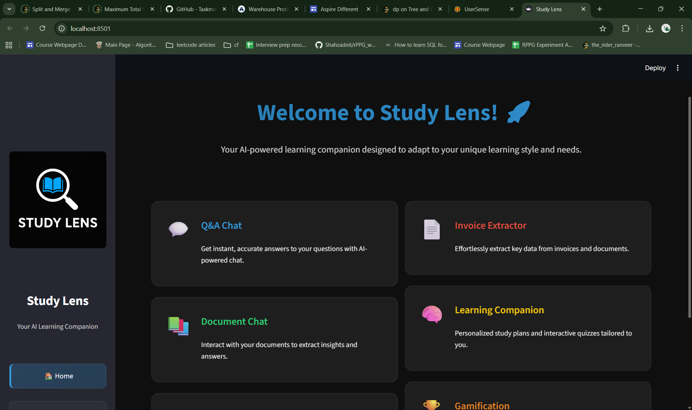
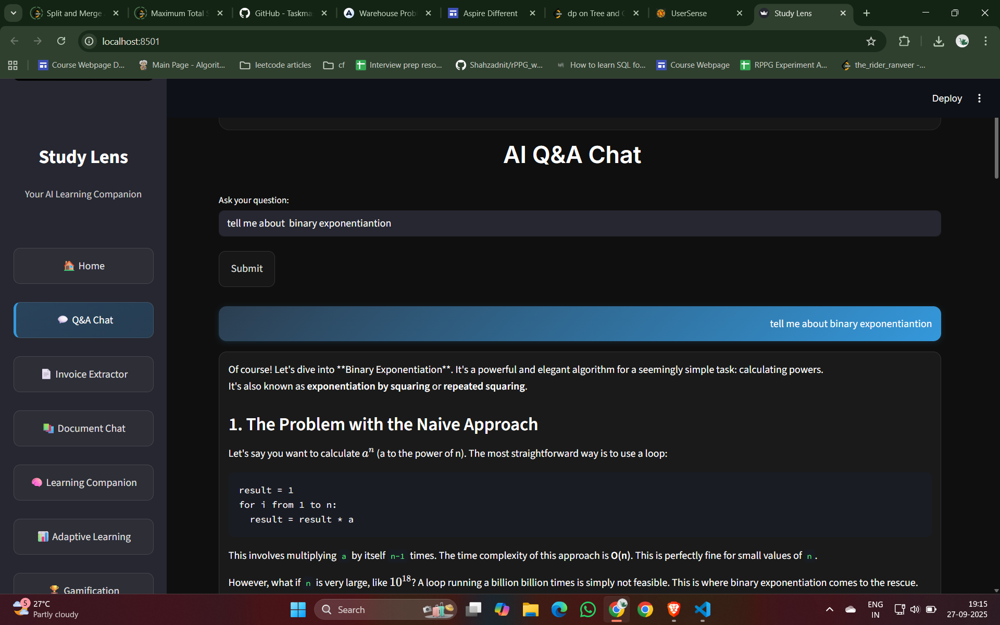
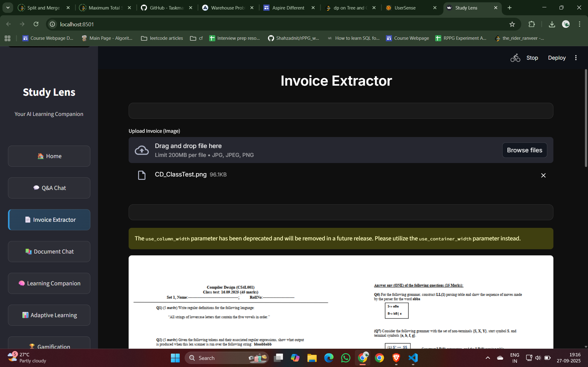
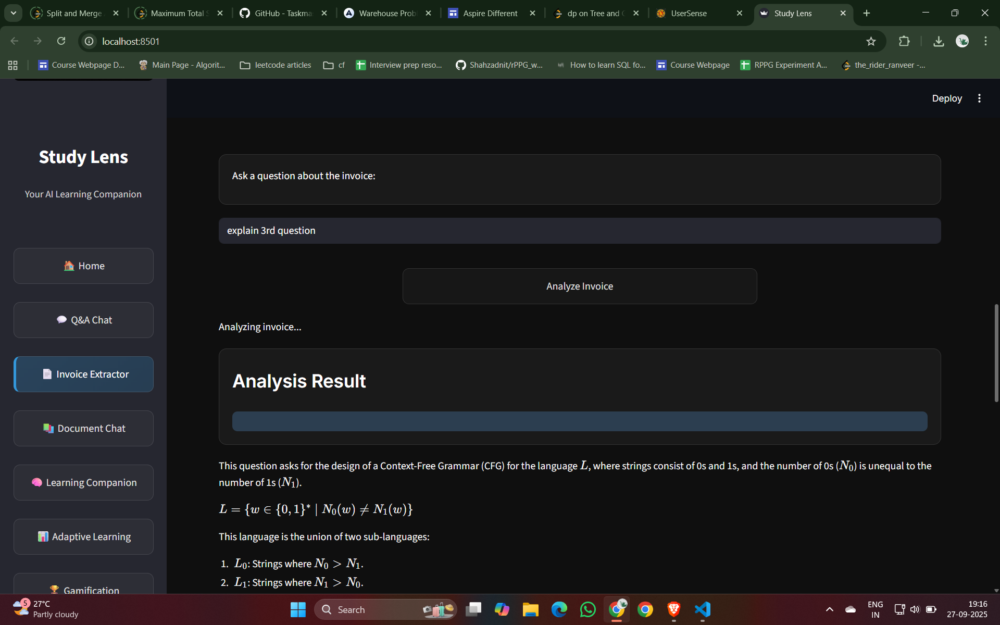
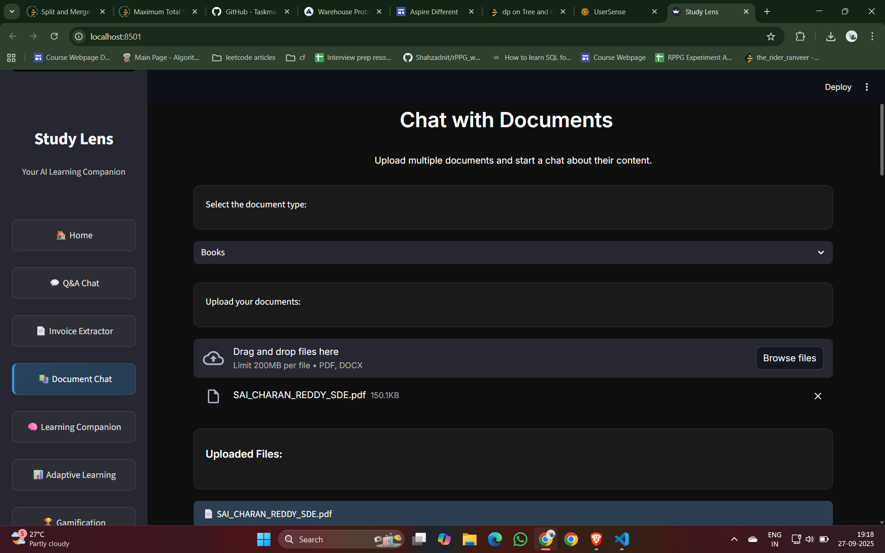
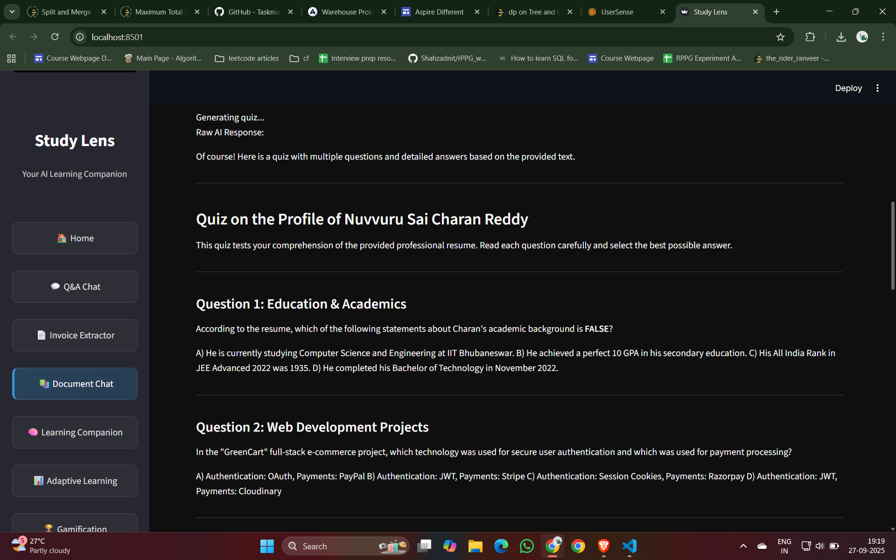
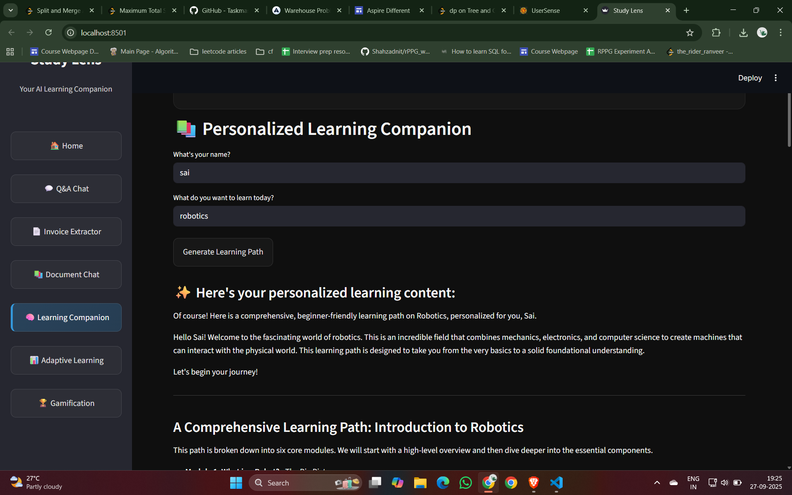

# 🧠 Study Lens


**Study Lens** is a powerful AI assistant designed to revolutionize how you **learn, work, and process information**. Combining natural language understanding with intelligent document processing, Study Lens empowers students, educators, professionals, and researchers to extract knowledge, generate content, and interact with information seamlessly.

---

## 🚀 Features
 

### 📊 Document Intelligence
- **Universal Document Reader**: Upload PDFs, DOCX, TXT, and more  
- **Smart Content Extraction**: Identify tables, key points & structure  
- **Interactive Q&A**: Ask questions directly about your documents  

### 🧠 Learning Enhancement Tools
- **Quiz Generator**: Create personalized quizzes for revision  
- **Flashcard Creator**: Auto-generate study aids with spaced repetition  
- **Concept Mapping**: Visualize relationships between ideas  

### 🔊 Accessibility Features
- **Text-to-Speech**: Natural-sounding speech in multiple languages  
- **Voice Commands**: Hands-free operation  
- **Screen Reader Friendly**: Optimized for accessibility tools  

### 🧾 Business & Productivity Tools
- **Invoice/Data Processing**: Extract structured data automatically  
- **Data Visualization**: Convert raw info into charts & graphs  
- **Meeting Summarizer**: Capture key points from recordings or notes  

---

## 💡 Use Cases

| User Type         | Use Cases |
|-------------------|-----------|
| **Students**      | Generate quizzes, summarize textbooks, create study guides |
| **Educators**     | Build teaching materials, simplify complex topics |
| **Professionals** | Process multilingual docs, extract invoice data, summarize reports |
| **Researchers**   | Analyze papers, create literature reviews, organize insights |
| **Accessibility Users** | Convert text to audio, hands-free information access |

---

## 🛠️ Technical Architecture

Study-Lens/
├── 🖥️ Frontend (Streamlit)
│ ├── Interactive UI
│ └── Responsive Sidebar + Theming
├── ⚙️ Backend (Python)
│ ├── Document Processing Engine
│ ├── Natural Language Understanding
│ └── API Integrations
└── 🧠 AI Core
├── LangChain Framework
├── OpenAI Integration
├── HuggingFace Transformers
└── Custom ML Models


---

## 📊 Performance Metrics
 
- **Document Processing**: 15+ formats supported  
- **Response Time**: <2 seconds for standard queries  
- **Data Extraction Accuracy**: >92% on structured data  

---

## 🚀 Getting Started

```bash
# 1. Clone the repository
git clone https://github.com/Taskmaster-1/Study-Lens.git
cd Study-Lens

# 2. Create virtual environment
python -m venv venv
source venv/bin/activate   # On Windows: venv\Scripts\activate

# 3. Install dependencies
pip install -r requirements.txt

# 4. Configure environment variables
cp .env.example .env
# Edit .env with your API keys

# 5. Run the application
streamlit run app.py














📄 License

This project is licensed under the MIT License – see LICENSE
 for details.

👏 Acknowledgements

OpenAI for LLM capabilities

HuggingFace for transformers

Streamlit for the web UI

Amazing open-source contributors 💙

<div align="center"> <b>Study Lens</b> — Your intelligent companion for smarter learning. </div> ```